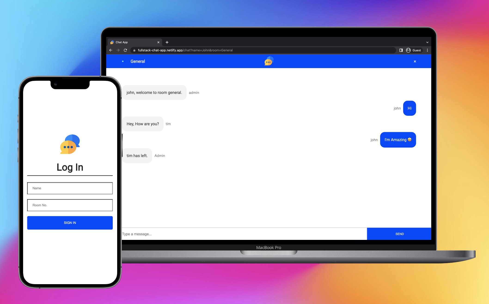

# Chat Platform 💬

Link: https://fullstack-chat-app.netlify.app/

## Description
Built a chatting platform in which users can communicate with each other in real time.
**Server Side:** Serves frontend files to the user, implement Web Sockets using socket.io and recieve message from user and broadcast it to all users in that room.

## Technologies Used
- Frontend: ReactJS
- Backend: NodeJS and Socket.io

## Contact Me
- Instagram: https://www.instagram.com/abhishek.x__/
- Github: https://github.com/abhishek-x
- LinkedIn: https://www.linkedin.com/in/abhishek-aggarwal-web/
- Drop an Email: abhishek.aggarwal836@gmail.com
